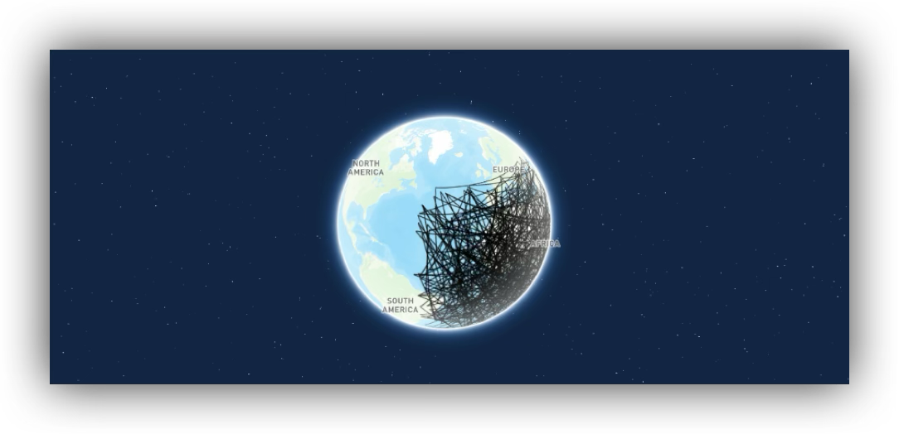

# Mapbox GL GOJS
Interactive map and geo visualization for Golang. Generate [Mapbox](https://github.com/mapbox/mapbox-gl-js) HTML.

## Docs https://visendi-labs.github.io/mapbox-gl-gojs/#/

#### Minimal Example

```go
package main

import (
	"html/template"
	"math/rand/v2"

	"github.com/gin-gonic/gin"
	"github.com/paulmach/orb"

	"github.com/paulmach/orb/geojson"
	mbgojs "github.com/visendi-labs/mapbox-gl-gojs"
)

func main() {
	lines := geojson.NewFeatureCollection()
	line := make(orb.LineString, 500)
	for i := 0; i < len(line); i++ {
		line[i] = orb.Point{-50 + rand.Float64()*100, -50 + rand.Float64()*100}
	}
	lines.Append(geojson.NewFeature(line))

	mapbox := mbgojs.NewScript(
		mbgojs.NewMap(mbgojs.Map{
			Container:   "map",
			AccessToken: "<MAPBOX_ACCESS_TOKEN>",
			Hash:        true,
			Config:      mbgojs.MapConfig{Basemap: mbgojs.BasemapConfig{Theme: "faded"}},
		}),
		mbgojs.NewMapOnLoad(
			mbgojs.NewMapAddLayer(mbgojs.MapLayer{
				Id: "layer", Type: "line",
				Source: mbgojs.MapSource{Type: "geojson", Data: *lines},
			}),
		),
		mbgojs.NewMapOnEventLayerCursor("mouseover", "layer", "pointer"),
		mbgojs.NewMapOnEventLayerCursor("mouseout", "layer", ""),
	)

	s := mapbox.MustRender(mbgojs.RenderConfig{})

	html := `<html><head>
	<script src='https://api.mapbox.com/mapbox-gl-js/v3.15.0/mapbox-gl.js'></script>
	<link href='https://api.mapbox.com/mapbox-gl-js/v3.15.0/mapbox-gl.css' rel='stylesheet' />
	</head><body style="margin:0"><div id="map" style="width:100vw; height:100vh;"></div>
	{{.}}</body></html>`
	r := gin.Default()
	r.GET("/", func(ctx *gin.Context) {
		t, _ := template.New("page").Parse(html)
		if err := t.Execute(ctx.Writer, template.HTML(s)); err != nil {
			panic(err)
		}
	})
	r.Run()
}
```




### TODO
- Fix Mapbox Popup logic
- Improve type safety
- Fix render config
- Acutal template files/file? Multiple defines in one file? #embed
- Add support for the mapbox draw extension tool?
- Use common template/index.html in examples
- Fix mapbox config (& more) defaults
- Option to add layers wihout specifying id (random)?