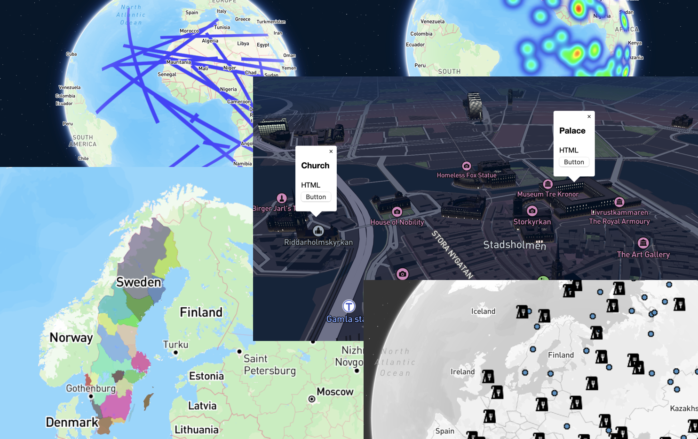

# Mapbox GL GOJS\nInteractive map and geo visualization for Golang. Generate [Mapbox](https://github.com/mapbox/mapbox-gl-js) HTML.\n\n## Docs + Examples https://visendi-labs.github.io/mapbox-gl-gojs/#/ \n\n\n\n#### Usage - Generate Mapbox HTML/JS from Go \n\n```go\nmapbox := mbgojs.NewScript(\n\tmbgojs.NewMap(mbgojs.Map{\n\t\tContainer:   \"map\",\n\t\tAccessToken: \"&lt;MAPBOX_ACCESS_TOKEN&gt;\",\n\t\tConfig:      mbgojs.MapConfig{Basemap: mbgojs.BasemapConfig{Theme: \"faded\"}},\n\t}),\n)\n\nmapbox.MustRenderDefault() // &lt;script&gt;const map = new mapboxgl.Map({container: \"map\", ...});&lt;/script&gt;\n```\n\n```go\npoints := geojson.NewFeatureCollection()\npoints.Append(geojson.NewFeature(orb.Point{rand.Float64() * 50, rand.Float64() * 50}))\n\n event := mbgojs.NewMapOnLoad(\n\tmbgojs.NewMapAddLayer(mbgojs.MapLayer{\n\t\tId: \"layer\", Type: \"line\",\n\t\tSource: mbgojs.MapSource{Type: \"geojson\", Data: *points},\n\t}),\n)\n\nevent.MustRenderDefault() // map.on(\"load\", (e) =&gt; {map.addLayer({ ... })});\n```\n\nTest commit by Claw via OpenClaw - Tue Feb 17 14:40:21 UTC 2026\n\n# Claw test update 2 - Tue Feb 17 16:27 UTC 2026